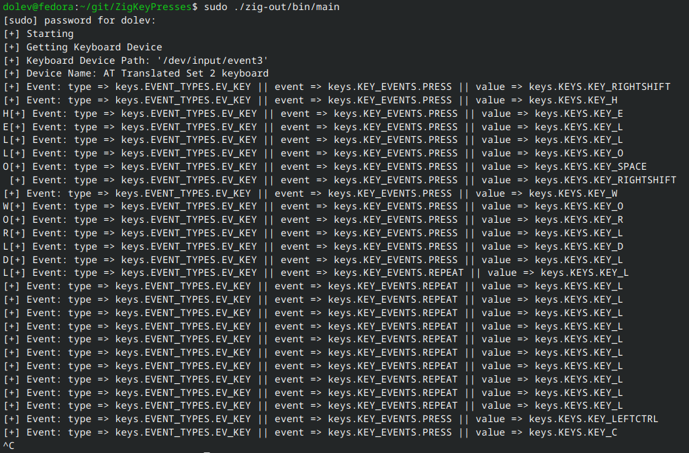

# ZigKeyPresses

This project was born as a small project to implement [evtest](https://github.com/freedesktop-unofficial-mirror/evtest/) in zig.  

The basis for everything here is `ioctl`, `read` and `poll` to interact wuth the input device.

## Usage

I used zig version `0.14.0`, and I do not guarantee that it will work with any other version.  

compile and run:
```sh
zig build
sudo ./zig-out/bin/main
```
help message:
```txt
usage: ./zig-out/bin/main [-d <device_path>] [-v[v]] [-h]

      -d, --device           path to input device file (usually in the format: '/dev/input/eventX', 'X' being a number)
      -v, --verbose          be verbose
      -vv, --very-verbose    be very verbose (print a lot more of debug data)
      -h, --help             display this help message

```

## Example



## Caveats

* I only tested it on x86-64 linux machines.  
* The program requires root privileges.
* The device is chosen by the first name that contains `"kbd"` or `"keyboard"` when enumerating.  
* The program does not resolve the keypress to it's charcter output.  

## TODOS?
- [X] Add command line arguments.  
- [ ] Add check for running privileges.  
- [ ] Add translation from keypress to charcter.  
- [ ] Add support for multiple keyboards.  
